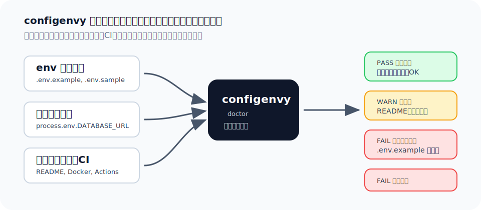

# configenvy

[](https://github.com/sonsriver4815/configenvy/actions/workflows/ci.yml)
[](https://www.npmjs.com/package/configenvy)
[](https://github.com/sonsriver4815/configenvy/releases)
[](LICENSE)

環境変数の不足、古い記述、ドキュメント漏れ、危険なサンプル値を、セットアップでつまずく前に見つけます。

`configenvy` は、環境変数の情報が散らばりやすい場所をまとめて確認する CLI です。`.env.example`、ソースコード、README/docs、Docker Compose、GitHub Actions、デプロイ設定を照合し、「このプロジェクトを動かすには何を設定すればよいか」を明確にします。



```bash
npx configenvy@latest doctor
```

環境変数の不足は、実行して初めて気づくことがよくあります。

```text
Error: DATABASE_URL is required
```

`configenvy` を使うと、必要な設定の抜け漏れを事前に確認できます。

```text
FAIL missing-example DATABASE_URL
  DATABASE_URL is used by code or required by config but is missing from .env.example files.
WARN undocumented STRIPE_WEBHOOK_SECRET
  STRIPE_WEBHOOK_SECRET is not mentioned in README or docs.
```

## Features

- `process.env.NAME`、`process.env["NAME"]`、`import.meta.env.NAME`、`Deno.env.get("NAME")` で参照されている環境変数を検出します。
- コード内の利用状況と `.env.example`、`.env.sample`、`.env.template` を比較します。
- 重要な環境変数が README や docs に書かれているか確認します。
- 実在しそうなトークン、秘密値、本番 URL など、サンプルとして危険な値を検出します。
- README に貼り付けやすい Markdown 表を生成します。
- 人が読むための通常出力と、CI やスクリプト向けの JSON 出力に対応します。

## Install

先にインストールしなくても使えます。プロジェクトのフォルダに移動して、これを実行します。

```powershell
cd "C:\path\to\your-project"
npx configenvy@latest doctor .
```

問題がなければ、こう表示されます。

```text
PASS configenvy found no environment variable issues.
```

## Quick Start

`configenvy` は、環境変数が `.env.example` に書かれているか、README や docs に説明があるかを確認します。

今いるフォルダをチェック:

```powershell
npx configenvy@latest doctor .
```

README に貼る表を表示:

```powershell
npx configenvy@latest table .
```

表をファイルに保存:

```powershell
npx configenvy@latest table . --out README.env.md
```

1つの環境変数だけ調べる:

```powershell
npx configenvy@latest explain DATABASE_URL .
```

PowerShell の注意:

- `.` は「今いるフォルダ」です。
- スペース入りのパスは `"..."` で囲みます。
- パスを `[]` で囲む必要はありません。

```powershell
npx configenvy@latest table "C:\path\to\your-project"
```

## CLI

```bash
configenvy doctor [path]
configenvy doctor --format json [path]
configenvy doctor --strict [path]
configenvy check --ci [path]
configenvy table [path] --out README.env.md
configenvy explain DATABASE_URL [path]
```

## What configenvy checks

- env サンプル: `.env.example`、`.env.sample`、`.env.template`
- ソースコード: `src/**/*.{js,jsx,ts,tsx,mjs,cjs}`
- ドキュメント: `README.md` と設定された docs パス
- CI / 実行環境の設定: `.github/workflows/*.yml`、Docker Compose ファイル、`vercel.json`

## Supported patterns

| Source | Supported patterns |
| --- | --- |
| Node.js | `process.env.NAME`、`process.env["NAME"]` |
| Vite / frontend | `import.meta.env.NAME` |
| Deno | `Deno.env.get("NAME")` |
| GitHub Actions | `${{ secrets.NAME }}`、`${{ vars.NAME }}`、`${{ env.NAME }}` |
| shell形式の設定 | `${NAME}` |
| docs | `DATABASE_URL` のような大文字の変数名 |

## Exit codes

| Code | Meaning |
| --- | --- |
| 0 | 問題なし |
| 1 | warning あり |
| 2 | error あり、または `check --ci` が失敗 |
| 3 | 実行時エラーまたは設定エラー |

## Configuration

設定なしでも使えます。必須の環境変数や無視したい変数を指定したい場合は、プロジェクトルートに `configenvy.config.json` を置きます。

```json
{
  "required": ["DATABASE_URL"],
  "optional": ["LOG_LEVEL"],
  "ignore": ["NODE_ENV"],
  "docs": ["README.md", "docs"]
}
```

- `required`: 必ず必要な環境変数
- `optional`: 任意の環境変数
- `ignore`: チェックしない環境変数
- `docs`: 説明を探すREADMEやdocs

## Why

セットアップが失敗する理由の多くは、意外と単純です。コードには環境変数を追加したのに `.env.example` は更新していない。README の環境変数表が古い。サンプルファイルにトークンのような値が混ざっている。`configenvy` は、こうした小さなズレを見える状態に保ちます。

## Limitations

v0.1 の `configenvy` は、軽量な静的抽出を使っています。すべての言語やフレームワークを完全に解析するわけではなく、`process.env[prefix + "_TOKEN"]` のような動的な変数名は検出できない場合があります。まずは、セットアップを壊しやすい典型的なズレを見つけるためのツールです。完全な secret scanner や型情報つきの compiler plugin を置き換えるものではありません。

## Roadmap

- PRに診断結果をコメントする GitHub Action
- code scanning ツール向けの SARIF 出力
- Next.js、Vite、Remix、Docker中心のプロジェクト向けプリセット
- false positive と検出漏れを減らすための、より深いAST解析
- env docsを編集しながら確認できる VS Code 拡張

## Privacy and safety

`configenvy` は、デフォルトで `.env` と example ではない `.env.*` ファイルを読みません。ローカルで実行され、ファイルをアップロードしたり外部APIを呼び出したりしません。

## License

MIT
