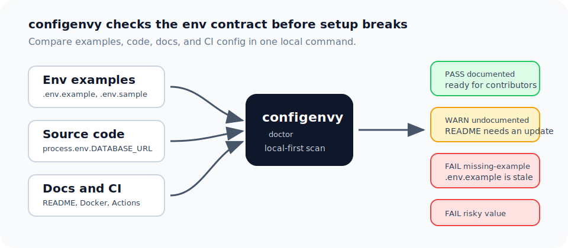

# configenvy

[](https://github.com/sonsriver4815/configenvy/actions/workflows/ci.yml)
[](https://www.npmjs.com/package/configenvy)
[](https://github.com/sonsriver4815/configenvy/releases)
[](LICENSE)

Catch missing, stale, undocumented, and risky env variables before they break someone else's setup.

`configenvy` checks the places env vars tend to drift: `.env.example`, source code, README/docs, Docker Compose, GitHub Actions, and deployment config. It gives contributors a clear answer to a simple question: "What do I need to set before this project runs?"



```powershell
npx configenvy@latest doctor
```

Without configenvy, setup failures often show up late:

```text
Error: DATABASE_URL is required
```

With configenvy, the missing contract is visible up front:

```text
FAIL missing-example DATABASE_URL
  DATABASE_URL is used by code or required by config but is missing from .env.example files.
WARN undocumented STRIPE_WEBHOOK_SECRET
  STRIPE_WEBHOOK_SECRET is not mentioned in README or docs.
```

## Features

- Finds env vars used through `process.env.NAME`, `process.env["NAME"]`, `import.meta.env.NAME`, and `Deno.env.get("NAME")`.
- Compares code usage with `.env.example`, `.env.sample`, and `.env.template`.
- Checks whether important variables are mentioned in README or docs.
- Flags sample values that look like real tokens, private values, or production URLs.
- Reuses `.env.example` comments as variable descriptions in generated tables.
- Generates Markdown tables you can paste into a README.
- Prints readable output for humans and JSON for scripts or CI.

## Install

You do not need to install anything first. Move to your project folder and run:

```powershell
cd "C:\path\to\your-project"
npx configenvy@latest doctor .
```

If everything is OK, you will see:

```text
PASS configenvy found no environment variable issues.
```

You can also install it in a project:

```powershell
npm install -D configenvy
npx configenvy doctor .
```

## Quick Start

Check the current folder:

```powershell
npx configenvy@latest doctor .
```

Create a starter config file:

```powershell
npx configenvy@latest init .
```

Generate a Markdown table:

```powershell
npx configenvy@latest table .
```

Save that table to a file:

```powershell
npx configenvy@latest table . --out README.env.md
```

Update a marked table block in README:

```md
<!-- configenvy:start -->
<!-- configenvy:end -->
```

```powershell
npx configenvy@latest table . --update README.md
```

Explain one variable:

```powershell
npx configenvy@latest explain DATABASE_URL .
```

PowerShell tips:

- `.` means the current folder.
- Wrap paths with spaces in quotes.
- Do not wrap paths in `[]`.

```powershell
npx configenvy@latest table "C:\path\to\your-project"
```

## CLI

```text
configenvy doctor [path]
configenvy doctor --format json [path]
configenvy doctor --format sarif [path]
configenvy doctor --strict [path]
configenvy check --ci [path]
configenvy check --ci --format sarif [path]
configenvy init [path]
configenvy init [path] --preset nextjs
configenvy init [path] --env-example
configenvy init [path] --dry-run
configenvy table [path] --out README.env.md
configenvy table [path] --update README.md
configenvy table [path] --update README.md --dry-run
configenvy explain DATABASE_URL [path]
```

`init` creates `configenvy.config.json` without overwriting existing files. Add `--preset` for common stacks, `--env-example` to draft missing variables into `.env.example`, `--dry-run` to preview writes, or `--force` to overwrite generated files. Presets include Astro, Docker, Next.js, Nuxt, SvelteKit, Vercel, and Vite. See [Framework Presets](docs/presets.md).

## What configenvy checks

- Env example files: `.env.example`, `.env.sample`, `.env.template`
- Source code: `src/**/*.{js,jsx,ts,tsx,mjs,cjs}`
- Documentation: `README.md` and configured docs paths
- CI and runtime config: `.github/workflows/*.yml`, Docker Compose files, `vercel.json`
- Generated, cache, test, and fixture directories such as `node_modules`, `dist`, `build`, `coverage`, `.next`, `.turbo`, `.vercel`, `.cache`, `out`, `test`, `tests`, `__tests__`, `__mocks__`, and `fixtures` are skipped by default.

## Supported patterns

| Source | Supported patterns |
| --- | --- |
| Node.js | `process.env.NAME`, `process.env["NAME"]` |
| Vite / frontend | `import.meta.env.NAME` |
| Deno | `Deno.env.get("NAME")` |
| GitHub Actions | `${{ secrets.NAME }}`, `${{ vars.NAME }}`, `${{ env.NAME }}` |
| Shell-style config | `${NAME}` |
| Docs | Uppercase names such as `DATABASE_URL` |

## Exit codes

| Code | Meaning |
| --- | --- |
| 0 | No issues found |
| 1 | Warnings found |
| 2 | Errors found, or `check --ci` failed |
| 3 | Runtime or config error |

`configenvy check --ci` also emits GitHub Actions annotations for warnings and errors when using the default text output. Use `--format sarif` when you want to upload results to GitHub code scanning or another SARIF-compatible tool.

## Config

configenvy works without a config file. Add `configenvy.config.json` to your project root when you want to mark variables as required or ignore noisy ones.

```json
{
  "required": ["DATABASE_URL"],
  "optional": ["LOG_LEVEL"],
  "ignore": ["NODE_ENV"],
  "docs": ["README.md", "docs"]
}
```

- `required`: env variables that must exist
- `optional`: env variables that are allowed but not required
- `ignore`: env variables to skip
- `docs`: README or docs paths where descriptions should be checked

Most setup failures are not mysterious. A variable was added in code but not in `.env.example`. A README table went stale. A token-like value slipped into a sample file. `configenvy` keeps that small contract honest.

## Limitations

`configenvy` uses lightweight static extraction in v0.1. It does not fully parse every language or framework, and it may miss dynamic names such as `process.env[prefix + "_TOKEN"]`. It is meant to catch the common setup-breaking drift first, not replace a full secrets scanner or type-aware compiler plugin.

## Roadmap

- GitHub Action for PR comments
- Framework presets for Next.js, Vite, Remix, and Docker-heavy projects
- Deeper AST parsing for fewer false positives and missed references
- VS Code extension for local feedback while editing env docs

## Privacy and safety

`configenvy` skips `.env` and non-example `.env.*` files by default. It runs locally, does not upload files, and does not call external APIs.
